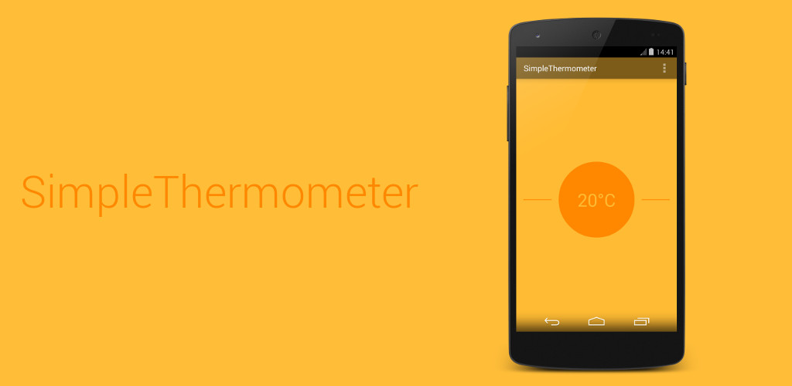

SimpleThermometerProject
========================
[Download From Play Store](https://play.google.com/store/apps/details?id=fr.tvbarthel.apps.simplethermometer)

###Description
SimpleThermometer gives you the outside temperature according to your location, and nothing more. This application is extremely light, fast, free and without any ads. It doesn't collect any personal data.

###Permissions
&rarr; Approximate location: SimpleThermometer uses your approximate location to give you a relevant temperature.

&rarr; Network access and connections: SimpleThermometer uses the network only to get the temperature from openweathermap, and that's it.

###Disclaimer
Developed by two students, this free and open-sourced application is distributed "as is", without any pretention.

* Thomas "Tbarthel" Barthélémy
* Vincent "Vbarthel" Barthélémy
 
This application uses http://openweathermap.org/

License
=====================
Copyright (C) 2014 tvbarthel

Licensed under the Apache License, Version 2.0 (the "License");
you may not use this file except in compliance with the License.
You may obtain a copy of the License at

    http://www.apache.org/licenses/LICENSE-2.0

Unless required by applicable law or agreed to in writing, software
distributed under the License is distributed on an "AS IS" BASIS,
WITHOUT WARRANTIES OR CONDITIONS OF ANY KIND, either express or implied.
See the License for the specific language governing permissions and
limitations under the License.
